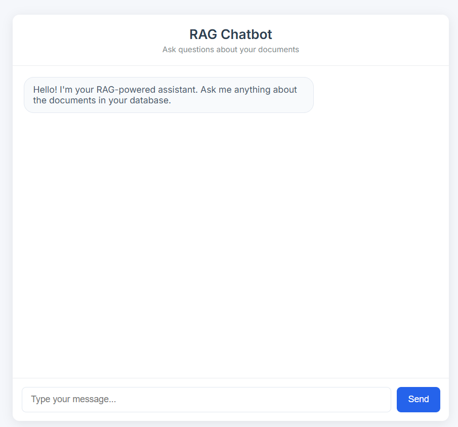

# RAG Chatbot UI

A modern web-based chatbot interface that uses Retrieval-Augmented Generation (RAG) to answer questions based on your document database.

## Overview

This application provides a conversational interface where users can ask questions about documents stored in a vector database. The system retrieves relevant context from the database and uses an LLM to generate accurate, contextual responses.

<p align="center" width="100%">
 
</p>

## Features

- **Conversational UI**: Clean, responsive chat interface with typing animations
- **RAG Architecture**: Combines document retrieval with language model generation
- **Markdown Support**: Bot responses support markdown formatting
- **Real-time Typing Effect**: Bot responses appear character-by-character for a more natural feel

## Technologies

Frontend

- HTML/CSS/JavaScript: Vanilla frontend implementation
- Marked.js: For rendering markdown in bot responses
  Backend
- Flask: Python web server
- LangChain: Framework for developing LLM applications
- ChromaDB: Vector database for storing document embeddings
- HuggingFace Embeddings: all-MiniLM-L6-v2 model for document embedding
- Ollama: Local LLM serving platform
- Llama3.1: The large language model used for generating responses

## Requirements

- Python 3.8+
- Ollama installed and running locally
- ChromaDB with ingested documents

## Setup & Installation

1. Clone this repository
2. Install backend requirements:

```bash
pip install -r requirements.txt
```

3.Ensure Ollama is installed and running:

```bash
# Check if Ollama is running
curl http://localhost:11434/api/version

# If not running, start Ollama and pull the model
ollama run llama3.1
```

4. Make sure your ChromaDB database is created in chroma_db (run your document ingestion script first if needed)

## Running the Application

1. Start the Flask server:

```bash
cd ui/server
python server.py
```

2. Open your browser and navigate to:

```
http://localhost:5000
```

## Usage

1. Type your question in the input box at the bottom
2. Press Enter or click the "Send" button
3. The bot will retrieve relevant context and generate a response
4. Continue the conversation as needed

## Customization

- Modify style.css to change the appearance
- Adjust RAG parameters in server.py such as:
  - Number of retrieved documents (k parameter)
  - Temperature for generation
  - Model selection
  - Prompt template

## Project Structure

```
ui/
├── readme.md                 # This documentation
├── frontend/                 # Frontend code
│   ├── chat.html             # Main HTML page
│   ├── chat.js               # Frontend JavaScript
│   └── css/
│       └── style.css         # CSS styling
└── server/                   # Backend code
    └── server.py             # Flask server and RAG implementation
```

## Contributing

Contributions are welcome! Please submit a pull request or open an issue for any bugs or feature requests.

## License

MIT License
